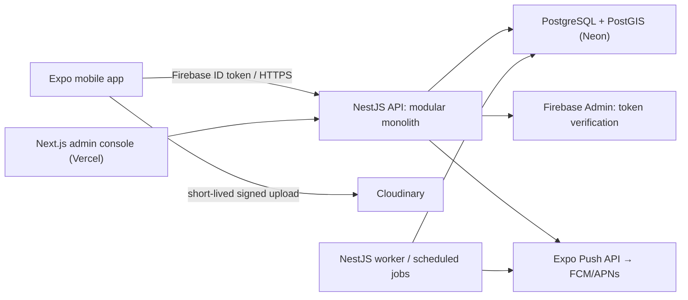

# CivicPulse — Software Architecture Specification (Phase 1)

**Status:** Proposed — pending founder approval  
**Scope:** Jaipur MVP, configured initially for Jhotwara  
**Last updated:** 10 July 2026

## 1. Executive summary

### Product boundary

CivicPulse is a citizen-owned record and guidance tool. It helps a signed-in citizen document a civic issue, determine a likely responsible department, find official complaint instructions, and maintain their own progress record. It is **not** a government grievance portal, does not submit complaints to government systems, and does not assert that an issue has been acted upon by an authority.

### MVP objective

Validate that a small, trustworthy Jaipur launch can help citizens complete the offline/external complaint journey and return to maintain a useful, privacy-conscious local issue record. The first release supports only Water Logging and Garbage Dump reports, with data/configuration designed for later expansion.

### Explicit non-goals

- Government API integration, automatic complaint submission, or automatic status synchronisation.
- A public unauthenticated portal, authority/volunteer workflows, escalation campaigns, or analytics product.
- Identity verification beyond Firebase phone authentication.
- AI image classification or autonomous department decisions.
- Multi-city administration UI, complex geographic management UI, and real-time collaborative editing.
- Guaranteed service resolution, legal advice, emergency response, or 24/7 support.

### Architecture recommendation summary

Build an Android-first Expo/React Native TypeScript application using Expo's managed workflow plus config plugins/EAS builds; move to prebuild only if Mapbox native requirements prove unsuitable. Use a NestJS TypeScript modular monolith API, PostgreSQL with Prisma, Cloudinary signed direct uploads, Firebase phone OTP with server-side Firebase ID-token verification, and an Expo Push Service delivery path backed by FCM credentials. Host the API and scheduled worker on Render, PostgreSQL on Neon, and the minimal admin console as a separate Vercel web deployment.

The application has one deployable API and one database. Feature modules own their routes, services, Prisma access, and policies; shared technical utilities remain small. This is deliberately not a microservice system.

## 2. Assumptions and product challenges

| Risk or assumption | Why it is harmful | MVP recommendation |
| --- | --- | --- |
| “Public by default” means fully public | Photos, descriptions, and accurate locations can expose homes, people, children, vehicles, or sensitive facilities. | Keep the requested default, but make it an explicit first-submit choice with a plain-language warning; anonymous public display only; round map pins to 150 m; strip EXIF; never show reporter data. |
| Immediate publication will build momentum | It also permits abuse, misleading content, doxxing, and unsafe images. | Publish immediately only after automated validation plus a minimal moderation state; do not index/search-share; allow admin unpublish. New reports appear as “Community report—unverified.” If moderator capacity is unavailable, start all public reports private/pending instead. |
| Citizens can reliably self-report lifecycle status | “Resolved” may mean a promise, a partial repair, or no work at all. | Label all citizen-entered statuses as self-reported. Require a confirmation prompt before “Resolved,” reserve “Verified” for citizen confirmation after inspecting the issue, and retain a timestamped audit trail. |
| Routing can be certain | Department ownership can vary by ward, road class, drainage asset, and season. | Store a routing recommendation with `confidence` and a configurable rationale; display “likely department” and an alternative contact path below a threshold. Admin maintains rules and official channel content. |
| External complaint submission is easy to prove | Users may not return, may not receive a number, or may enter sensitive identifiers. | Make “I submitted it” a simple attestation, allow a reference number optionally, explain it stays private, and schedule one gentle follow-up. Never represent it as verified by government. |
| Exact pins help nearby discovery | Exact coordinates can create safety, privacy, and harassment risks. | Store exact location encrypted/restricted for reporter use; derive a public rounded point/geohash for nearby queries. Do not disclose private reports in any aggregate, count, map, search, or notification. |

Additional launch constraints: begin with **Android, Jaipur, Jhotwara** and Hindi/English-ready copy. Treat location permission as optional until a category rule requires it; manual locality/landmark entry remains an alternative. Add a visible “not for emergencies” notice with relevant emergency guidance. Avoid claiming official affiliation unless formal permission is obtained.

## 3. Technical decisions and alternatives

| Decision | Options considered | Recommendation and rationale |
| --- | --- | --- |
| Mobile runtime | Expo managed; Expo prebuild/bare React Native | **Expo managed + config plugins/EAS**. Fastest reliable solo-founder path, OTA updates, camera/location/secure storage/notifications/offline libraries. Use a development build, not Expo Go, for real push and native maps. Prebuild only if a required native SDK/configuration cannot be supported by a plugin. |
| Navigation and UI | Expo Router vs React Navigation; custom UI vs a large component framework | **Expo Router** for file-based navigation and deep links; small shared design system using React Native primitives. Avoid a heavyweight UI kit initially. |
| Client state | Redux; Zustand; React Query only; server state in component state | **TanStack Query** for server/cache/retry state, **Zustand** only for small local UI/auth/offline-queue state, and React Hook Form + Zod for forms. This separates remote data from local draft UX without boilerplate. |
| API style | REST; GraphQL; tRPC | **Versioned REST JSON** with OpenAPI generated by NestJS. It is easy to debug from mobile, suits future public/admin clients, and keeps validation/authorization obvious. |
| Backend structure | Microservices/CQRS/clean layers; modular monolith | **NestJS modular monolith**: `auth`, `users`, `reports`, `categories`, `routing`, `channels`, `nearby`, `media`, `notifications`, `admin`, and `audit`. Use direct Prisma access inside a module. Extract only after independent scaling or operational ownership is demonstrated. |
| Database | PostgreSQL; Firebase/Firestore; MongoDB | **PostgreSQL + Prisma**. Relational consistency, transaction support, geospatial queries via PostGIS, strong audit constraints, managed backups, and good admin/reporting foundations. |
| Geospatial query | App-side distance filtering; PostGIS; external search | **PostGIS** on PostgreSQL. Persist `public_point geography(Point,4326)` and use indexed `ST_DWithin` for viewport/radius results; do not return raw precise coordinates. |
| Maps/geocoding | Mapbox; Google Maps | **Google Maps Platform for MVP**, behind a `MapProvider` interface. Jaipur address/landmark/Places coverage and native map SDK maturity are more valuable than a Mapbox preference for this precise launch. Google supplies official React Native/map SDK guidance and India-priced Essentials free usage caps (currently 70,000 for applicable India SKUs); budget alerts remain mandatory. Mapbox has attractive styling and its Expo integration is viable, but validate Jaipur geocoding quality before switching. Google geocoding results have display/attribution policy constraints, so cache only permitted data and render results on a Google map where required. |
| Media upload | Proxy all bytes through API; unsigned direct uploads; signed direct uploads | **Short-lived signed direct Cloudinary uploads**. API verifies Firebase user, creates a signed upload intent scoped to a report/user folder and allowed image formats/size; mobile uploads directly, then registers returned asset metadata with API. Do not expose an unsigned preset that permits arbitrary uploads. |
| Authentication | Custom OTP; Firebase Auth; Auth0 | **Firebase Phone Authentication**. Mobile obtains a Firebase ID token; every API request uses `Authorization: Bearer`; API verifies token with Firebase Admin SDK and upserts the local user. Firebase UID is the identity key, never a phone number. |
| Notifications | Direct FCM; Expo Push Service; local only | **Expo Notifications + Expo Push Service**, configured with FCM v1 for Android and APNs when iOS begins. It is the lowest-complexity cross-platform path; store Expo tokens (and optional native tokens for later migration), process push receipts, and deactivate invalid tokens. Direct FCM is a future option if advanced targeting/control is justified. |
| Background work | Cron in API process; queue service; managed scheduler | **Database-backed scheduled job runner** in a separately deployed worker process, triggered every 10 minutes; use PostgreSQL row locking/idempotency. No Redis/queue product for MVP. |
| Admin | Native app screens; admin web; database access | **Small protected Next.js admin web console**. It handles categories, routing rules, official channels, moderation/unpublish, and support review. No direct production database edits. |

## 4. System architecture and deployment topology

Recommended deployment: Render hosts two Docker services from the same backend image—an HTTPS API and a worker command—with managed secret injection, health checks, deploy logs, and a non-root container. Neon hosts the managed production PostgreSQL/PostGIS database with PITR/backups appropriate to the selected plan. Vercel hosts the admin console. Cloudinary, Firebase, Google Maps, and Expo are managed external services. Use Sentry for mobile/API error reporting and Render/Vercel logs plus a health endpoint for operational visibility.

| Hosting option | Strengths | Weaknesses | Decision |
| --- | --- | --- | --- |
| Render + Neon + Vercel | Simple Git deployments, separate API/worker, managed Postgres, secure env vars, low operational burden. | Multiple vendor accounts; paid plans needed for production reliability. | **Recommended.** |
| Railway (API/worker/Postgres) + Vercel | Very quick all-in-one prototype, simple service variables. | Less clear separation/back-up posture as scale grows; verify regional availability and sleep/limits on chosen plan. | Viable fast prototype alternative. |
| Google Cloud Run + Cloud SQL + Cloud Scheduler | Strong Google/Firebase affinity, IAM, observability, scalable. | More setup, IAM/networking/billing complexity for one founder. | Future move only if scale/compliance needs justify it. |

Use separate Firebase, Cloudinary, Maps, Expo, Sentry, Render, Neon, and Vercel projects for development/staging/production where affordable. Secrets live only in service secret stores/EAS; never in the app binary except public client configuration. Daily automated database backups/PITR, monthly restore rehearsal, and encrypted backups are required before public launch.

## 5. Domain model and data ownership

### Core entities

| Entity | Key fields / rules |
| --- | --- |
| `User` | `id`, `firebaseUid` (unique), phone E.164 encrypted or omitted unless operationally required, role (`CITIZEN`, `SUPER_ADMIN`), locale, consent/version timestamps, disabled timestamp. |
| `GeographyScope` | Config records for country/state/city/constituency/locality. MVP seed data is India/Rajasthan/Jaipur/Jhotwara; UI only exposes a launch-area selector/check. |
| `Category` | Slug/name, active flag, `formRules` JSON (photo/location requirement, guidance, min/max description), public display policy, sort order. |
| `RoutingRule` | Category + optional geography scope + priority, recommended department, confidence, explanation, alternatives. Deterministic highest-specificity rule wins. |
| `Department` / `OfficialChannel` | Department details and reviewed official web/phone/instructions, effective dates, last-verified date, active flag. No user-submitted external URLs in MVP. |
| `Report` | Public UUID, owner, category/routing snapshot, visibility, moderation state, lifecycle status, description, manual locality, exact restricted location, public rounded location, submission reference encrypted, timestamps/version. Routing and channels are snapshot at submission so history stays explainable. |
| `ReportMedia` | Report, Cloudinary public ID, secure delivery URL, width/height/content type/hash, scan/moderation state. EXIF removed before display. |
| `ReportActivity` | Append-only actor/type/payload/occurred-at record for creation, field change, status change, visibility, moderation, routing snapshot, uploads and reminders. |
| `DeviceInstallation` | User, Expo/native token, platform, app version, permission state, active/last-seen/invalidated timestamps. Unique by token. |
| `Reminder` / `NotificationDelivery` | Intent, report/user, due time, state, idempotency key, preference category, provider receipt/error. |
| `OfflineSyncReceipt` | User + client idempotency key + resulting report ID; retained long enough to replay safely. |

Use database UUID primary keys, `createdAt`/`updatedAt`, optimistic `version` on mutable report state, foreign keys, and strict tenant ownership checks. Encrypt phone/reference number and exact location with an application-managed envelope key/KMS; restrict decryption to the owning citizen/admin support purpose. Hash image bytes client-side or on registration for duplicate diagnostics, never as an identity signal.

## 6. Report lifecycle, permissions, and audit history

### Replace “Ready” with validation state

Do **not** store `Ready` as a lifecycle status. Draft completeness is derived from the configured category form rules. A valid draft displays “Ready to submit” in the UI; the persisted status remains `DRAFT` until the citizen creates the CivicPulse record. This prevents a redundant state and makes changing form rules safe. “Ready” may be added later only if a distinct review/submission handoff exists.

### Valid transitions

| From | To | Actor / condition |
| --- | --- | --- |
| New/local only | `DRAFT` | Citizen creates local or server draft. |
| `DRAFT` | `SUBMITTED` | Citizen; current category rules validate; user confirms external complaint is submitted or chooses to track in CivicPulse. A complaint reference is optional. |
| `SUBMITTED` | `ACKNOWLEDGED` | Citizen self-reports government acknowledgement. |
| `SUBMITTED`, `ACKNOWLEDGED` | `WORK_STARTED` | Citizen self-reports observed/communicated work. |
| `SUBMITTED`, `ACKNOWLEDGED`, `WORK_STARTED` | `RESOLVED` | Citizen reports authority says or work appears resolved. |
| `RESOLVED` | `VERIFIED` | Citizen confirms it is actually resolved. |
| `VERIFIED` | `CLOSED` | Citizen closes; system may offer close after a configurable 7-day reminder, never auto-close without a visible notification. |
| `RESOLVED`, `VERIFIED`, `CLOSED` | `REOPENED` | Citizen says the issue persists/returned; description/reason required. |
| `REOPENED` | `SUBMITTED` | Citizen confirms a new/follow-up complaint was submitted; otherwise it remains reopened for follow-up. |

Admin cannot advance a citizen’s civic-progress status. Admin may set `moderationState` (`PENDING`, `PUBLISHED`, `HIDDEN`, `REMOVED`) and `operationalFlag` (`NONE`, `DUPLICATE_SUSPECTED`, `SAFETY_REVIEW`) with a reason; these are separate from lifecycle status. A super admin can correct an obvious category/routing data error, with an activity event and citizen notice. All lifecycle changes append a `ReportActivity` row in the same transaction; activity rows have no update/delete application endpoint. Soft-delete/anonymisation preserves non-identifying aggregate/audit records under a documented retention policy.

## 7. Public visibility, nearby issues, and privacy

“Public” means visible **only to authenticated CivicPulse users** in the supported Jaipur area and matching nearby radius/viewport. It is not crawlable, publicly shareable, or visible without login. The display is anonymous: category, status, relative date, rounded location/locality, and a sanitized/redacted description. Images are withheld by default from nearby cards and shown only after basic automated checks/moderation; never display reporter name, phone, complaint reference, exact address, raw coordinates, EXIF, or precise timestamps.

Privacy controls:

- Default report visibility is `PUBLIC`, but require an unmistakable Public/Private confirmation at first submission; `PRIVATE` is exclusive to the reporter and super admins for support/moderation.
- Public points are snapped to a deterministic 150 m grid, or use a locality-only marker when a report is within 250 m of a residence, school, health facility, shelter, or other sensitive site. Do not show a point at all when safe display cannot be assured.
- Nearby API accepts bounded radius (250 m–5 km) or viewport, returns at most 100 reports, rounded geometry only, and rate-limits/paginates to prevent systematic reconstruction. No cluster count must reveal private reports.
- Apply server-side PII and abuse checks to description, metadata stripping, file-size/type limits, malware/content moderation where available, reporting/blocking, and a fast unpublish workflow. Do not use face blurring as a sole control; ask users not to include identifiable people or licence plates.
- Public changes from `PUBLIC` to `PRIVATE` remove the report from nearby results immediately. Cached responses use short TTLs and are purged on moderation/visibility changes.

Launch recommendation: public reports may show after automated checks as `PUBLISHED` but with an “unverified community report” label. If basic moderation cannot be operated daily, retain `PENDING` and publish only after review. This reduces reach but protects trust and people.

## 8. Offline-first behaviour

Offline creation requires a previously authenticated, non-expired Firebase session. First sign-in, token refresh after expiry, official-channel lookup, and initial category/config download require connectivity. The app caches the active category/routing/channel configuration with version and expiry; it clearly tells users if guidance is stale.

1. A draft is stored locally in encrypted SQLite (SQLCipher-compatible Expo solution) with a client-generated UUID and image file paths in app-private storage. It is editable/deletable until successful registration.
2. On connectivity return, a single FIFO queue processes only when an authenticated token can be refreshed. Each operation carries `Idempotency-Key: clientDraftId` and a monotonic local operation ID.
3. API creates/returns the same server report for a repeated create key and records `OfflineSyncReceipt`. The client then asks API for short-lived upload signatures per pending image, uploads directly to Cloudinary, and registers each asset using its Cloudinary asset/public ID.
4. Only after required media registration and server validation does the app finalize the report/submission transition. The server remains authoritative for validation, visibility and lifecycle.
5. Network/5xx errors use exponential backoff with jitter (for example 30 s, 2 m, 10 m, hourly; max 10 automatic attempts), then become “Needs attention.” 4xx validation/auth errors halt that item and explain the action needed. Background sync is best-effort; foreground resume offers a Sync now action.

UI states are `Saved on this device`, `Waiting for connection`, `Syncing`, `Synced`, `Needs attention`, and `Upload failed`. Never claim “submitted to government” from a sync success. If the app is uninstalled before sync, local drafts are lost; state this plainly. No multi-device draft merge: latest successful report field update wins only after an `If-Match` report version; a conflict asks the user to reload or save as a new draft.

## 9. API, security, and operational controls

### API surface (MVP)

- `GET /v1/bootstrap` — active launch scope, category/config revision, channel/routing cache hints.
- `POST /v1/auth/session` — verify bearer token/upsert profile; subsequent routes use bearer guard.
- `POST /v1/reports` — create/idempotently return draft/report.
- `GET/PATCH /v1/reports/:id`, `POST /v1/reports/:id/transitions`, `POST /v1/reports/:id/media-intents`, `POST /v1/reports/:id/media`.
- `GET /v1/nearby?bbox=…` or bounded `lat/lng/radius` — only authenticated public-safe projection.
- `GET /v1/categories`, `GET /v1/reports/:id/guidance`, `POST /v1/device-installations`, `PATCH /v1/notification-preferences`.
- `/v1/admin/*` — super-admin guard, categories/rules/channels/moderation/audit views.

Use DTO validation, OpenAPI, consistent RFC 9457-style error payloads, request IDs, API versioning, and rate limits by user/IP/device. Verify Firebase issuer, project/audience, signature, expiry, and revoked tokens using Firebase Admin; never trust a client-provided UID or role. A database role assignment overrides client claims; Firebase custom claims are optional later.

TLS everywhere, HSTS, CORS allow-list, helmet/security headers, parameterized Prisma queries, encrypted secrets, least-privilege Cloudinary/Firebase service credentials, redacted structured logs, Sentry PII scrubbing, dependency scanning, and audit access controls are baseline. Perform threat modelling and privacy review before beta. Retain private report/media only while needed (suggest 24 months after closure), allow deletion requests, and define a legal privacy notice and data-processor inventory before launch.

## 10. Notifications and reminders

Ask for notification permission only after the citizen gets value (for example, after saving/submitting a report). Default all reminder categories **on** once permission is granted; each is separately opt-outable, and a global push opt-out is always available. In-app notification centre remains available regardless of push permission.

| Reminder | Default cadence | Stop condition |
| --- | --- | --- |
| Incomplete draft | One reminder after 24 hours, one after 7 days | Draft submitted/deleted or preference off. |
| Submission follow-up | Day 2 and day 7 after valid draft | Citizen marks submitted, deletes draft, or opts out. |
| Status follow-up | Once 14 days after `SUBMITTED`/`ACKNOWLEDGED`, then every 30 days; max 3 | Any lifecycle update, closure, or opt-out. |
| Verification follow-up | Day 3 and day 10 after `RESOLVED` | Verified/reopened/closed or opt-out. |

Store every intended reminder and delivery receipt; give each an idempotency key so restarts cannot double-send. The worker selects due reminders under row locks, sends Expo Push requests in batches, fetches receipts, and deactivates invalid tokens. Push payloads contain no address, complaint number, description, or sensitive issue details—only a generic prompt and deep-link report ID.

## 11. Configuration, administration, and future extension points

Seed category and routing configuration from reviewed version-controlled data, then administer it through the protected console. All config edits are versioned/audited, staged (draft → published), and can be rolled back. Official channels have an owner and `lastVerifiedAt`; expiry makes the app show a warning rather than stale “official” guidance.

Future-ready seams, intentionally unimplemented:

- Provider interfaces for `MapProvider`, `NotificationProvider`, `MediaProvider`, and `GovernmentChannelProvider`; the MVP binds one concrete implementation each.
- Geography is data-driven, but not a hierarchy-management product.
- An `ExternalComplaintLink`/integration module can be introduced only after a government partner grants documented authorization and security review is complete.
- Analytics reads from append-only activities or a replica; do not introduce an event bus now.
- Volunteer/authority/public-portal roles require separate authorization, moderation, consent, and threat-model design—not extra enum values alone.

## 12. Delivery plan, acceptance criteria, and approval gates

### Suggested implementation slices (after approval)

1. Foundation: monorepo, environments, Firebase verification, Prisma/PostGIS migrations, health checks, observability.
2. Config/admin: seeded Jhotwara categories, routing rules, official channels, super-admin console.
3. Citizen core: OTP, report form, guidance, lifecycle, immutable activity, privacy controls.
4. Media/maps/nearby: signed uploads, safe location projection, authenticated nearby map/list.
5. Offline/notifications: encrypted draft queue, idempotent sync, worker, preferences/reminders.
6. Hardening/beta: automated tests, device testing, accessibility/i18n baseline, privacy/security review, runbooks and backup-restore test.

### MVP acceptance criteria

- A signed-in Jhotwara citizen can create Water Logging or Garbage Dump reports with category-driven validation, receive reviewed external complaint guidance, and record the manual lifecycle.
- Private reports never appear through nearby endpoints, map rendering, counts, notifications, or error logs; public results expose only safe anonymous projections.
- Repeated offline sync requests do not create duplicate reports or media registrations; every meaningful mutation is auditable.
- Firebase ID tokens are validated server-side, RBAC is server-enforced, and super-admin actions are auditable.
- Reminder cadence/preferences, invalid-token handling, health checks, backups, error monitoring, and an incident/unpublish runbook are verified before beta.
- The product never implies that CivicPulse submitted, received, or confirmed a government complaint/status.

### Decisions requiring founder approval

1. Confirm the safety override: “public by default” requires an explicit confirmation and anonymous, rounded display; public images remain moderated/hidden by default.
2. Confirm the Android-first Jhotwara beta and two-category scope.
3. Confirm Google Maps Platform over Mapbox for Jaipur MVP, with budget alerts and later reevaluation after a field-quality test.
4. Confirm Render + Neon + Vercel deployment and a paid production posture for no-sleep API, backups/PITR, monitoring, and secret management.
5. Confirm the external-complaint attestation model and no government integration in MVP.

No application implementation, dependencies, scaffolding, or configuration has been created under this Phase 1 specification. Implementation begins only after explicit approval of these decisions.
